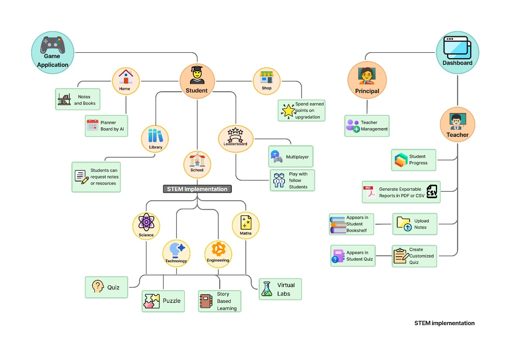

# 🎮 Vision Forge – Gamified Learning Platform (SIH25048)

## 📌 Problem Statement  
Students in rural India face two big challenges:  
- **Engagement Gap** → Existing e-learning apps are text-heavy and boring.  
- **Connectivity Gap** → Weak or no internet prevents access to interactive EdTech solutions.  

---

## 💡 Our Solution  
A **2D village-style metaverse learning platform** where students study by playing:  
- **School** → Subject-wise quizzes, puzzles & story-based challenges.  
- **Arcade** → Multiplayer mini-games & peer-to-peer quizzes.  
- **Library** → Offline-first study materials + requested notes delivered to student’s bookshelf.  
- **Shops** → Use reward points to customize avatars, apartments, and pets.  
- **Leaderboard Plaza** → Weekly rankings based on earned points.  
- **Teacher Dashboard** → Progress tracking, quiz creation, AI insights.  

---

## 🚀 Key Innovations  
1. **AI-Driven Student Analysis & Level System**  
   - AI finds weak areas → assigns personalized difficulty & levels.  

2. **Immersive Storytelling & Virtual Labs**  
   - Play as chapter characters (English/Hindi) & conduct safe experiments in virtual labs (Science).  

3. **Multiplayer Learning**  
   - Peer-to-peer quizzes, real-time duels, and collaborative mini-games.  

4. **Education Integrity Protocol (EIP)**  
   - Device fingerprinting + SHA-256 hashing + digital signatures + zero-trust validation → ensures no cheating or tampering, even offline.  

---

## 🛠️ Tech Stack  
- **Frontend & Game Engine** → Godot (Lightweight 2D), React Native (mobile wrapper)  
- **Backend & Database** → Node.js, Firebase Firestore, SQLite (offline)  
- **AI & Analytics** → Python, TensorFlow Lite, Scikit-learn  
- **Offline Sync** → PouchDB + CouchDB Delta Sync  
- **Security** → RSA/ECC Digital Signatures, SHA-256 Hashing, Zero-Trust Validation  

---

## 📊 System Architecture  
  

---

## ⚡ Algorithms Used  
- Decision Trees (weak area detection)  
- K-Means Clustering (student grouping)  
- Recommendation Engine (next chapter suggestions)  
- Level Progression System (gamified learning path)  
- Dynamic Difficulty Adjustment (keeps engagement high)  

---

## 🎥 Demo Video  
  
*(Click to play demo on YouTube)*  

---

## 📸 Screenshots & Mockups  
| Student Village | Teacher Dashboard | Library | Leaderboard |  
|-----------------|-------------------|---------|-------------|  
|  |  |  |  |  

---

## 📈 Feasibility  
- **Lightweight (120–150 MB per class)** → works on 2GB RAM phones.  
- **Offline-first** → only leaderboards & sync need internet.  
- **Low-cost** → open-source stack, minimal cloud usage.  
- **Scalable** → expandable from Class 6–12 to nationwide adoption.  

---

## 🌍 Impact  
- **Social** → boosts engagement, collaboration, and teacher-student-parent ecosystem.  
- **Economic** → zero extra hardware, scalable via CSR & Govt. programs.  
- **Educational** → AI-driven personalization, inclusive multilingual content.  
- **Long-Term** → digital literacy & competitive exam readiness.  

---

## 👥 Team – Vision Forge  
- Jiya Singh
- Aaryansh Singh
- Abhijit Manoj
- Ajay Yadav
- Akash Yadav
- Ankit Kumar Vaishya     